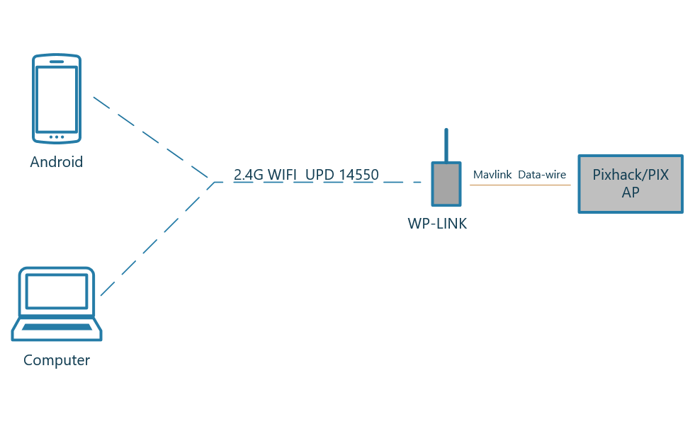

#PW-Link

### PW-Link Product Description

---

The PW-Link model data transmission module is a 2.4G wireless data transmission module. Has the following use advantages:

* High performance network communications processor, ESP8266;

* Simple and fast UDP broadcast communication with low overhead;

* Mobile phones of various types can be quickly connected through the WiFi module;

* Applied to various ground station software supporting UDP communication;

### PW-Link Product Features

---

| features | instruction |
| :---: | :---: |
| Wireless standards | IEEE 802.11g、IEEE 802.11b |
| transmission speed | 11g：Maximum reach 54Mbps、11b：Maximum reach 11Mbps |
| Link mode | UDP：14550 |
| Channel range |1-13 (default 11 channels) |
| frequency range  | 2412 - 2472MHz |
| Transmit power | 18dbm |
| Antenna type | UFL type |
| Wireless security | WPA/WPA2 Security mechanism |
| letter of agreement|Serial transparent transmission mode |
| traffic rate | 57600 |
|  working voltage | 5V +- 0.25V |
|  working current  | 100MA |
| working temperature | -20 - 50°C |
| Working humidity| 10% - 90%RH（noncondensing） |
| Storage temperature| -40 - 80°C |
| Storage humidity | 5% - 90%RH（noncondensing） |
### PW-Link Product Summary

---

At present, PW-Link data transmission module is divided into ** built-in antenna** and **external antenna** version. The built-in antenna version is only suitable for various calibration and adjustment parameters of the **PIX flight control ** close range, and the actual transmission distance of the external antenna version after many practical tests is **450** meters. Using the computer ground station Mission Planner for long-term connection tests, the average stability of the data transmission signal is maintained at more than **90%**. Due to its small size**, long distance**, stable data**, and easy-to-connect** features, it is ideally suited for digital receivers within a few hundred meters of a small drone.

PW-Link overall communication method as shown in figure:

> If there is an error in the product tutorial, please give feedback. Author's E-mail: xiepeng@cuav.net

