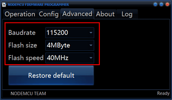
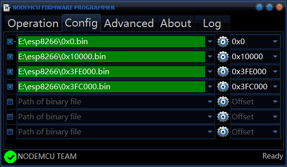
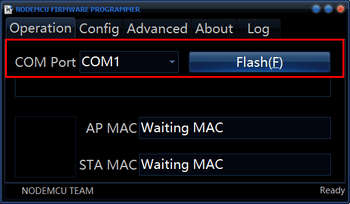
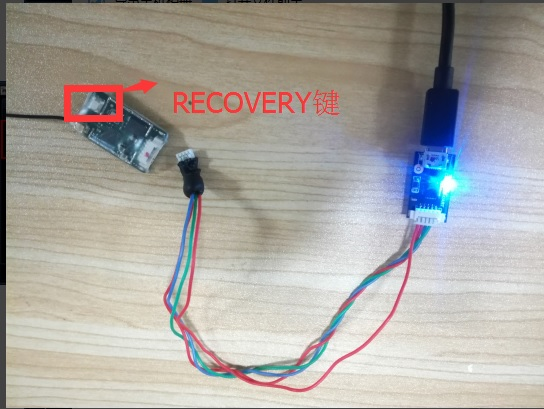
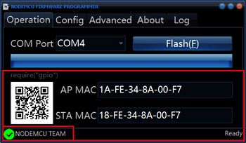

# update program description

At present, no online update program is provided for the PW-Link module, requiring the user to manually update the program. Need to download [burn software](http://fw.cuav.net/pc/ESP8266Flasher.rar) and [the latest version of the package](http://fw.cuav.net/pc/wifilink.rar) and unzip Packages. The specific programming steps are as follows:

1. Run the burning software ESP8266Flasher.exe, click the **Advanced** option, modify the corresponding options as shown in the figure;

2. Click on the **Config** option and click the right triangle to change the file name to the following image. Look at the green font area and click on the triangle icon in the area.

Find the file with the same name on the right and click Open to set the file path. (Note that the file path of the green area corresponds to the file name of the right white font)

3. Click on the **Operation** option and use the ** burn line ** to connect the TTL board to your computer's usb (you can make a custom burn line to see the ttl board and the logo on the back of the pw\_link, and connect the gnd and 5v accordingly. , rx, tx cross-connect) Select the corresponding port \ (port can be viewed in the My Computer "device manager" port), hold down the data recovery module recovery button and power module, click the ** Flash** button;

1. Prompt success map is as follows (Flash module blue LED will flash;

> The latest version is now 2.0.0. After the module is running normally, IO0 is shorted to GND for more than 5 seconds to restore the network's default configuration. The blue light is on or off indicating that the recovery is complete. Remember not to short-circuit and power up at the same time. This is to enter the programming mode.