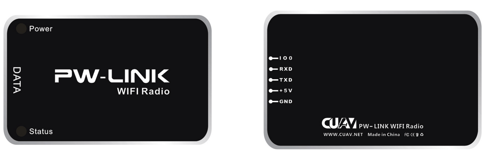

# hardware connection description

### PW-Link Hardware Interface Definitions

---

### How to connect to the flight control?

---

Use the dedicated data cable to connect the line of PW\_LINK to the RADIO/TELEM interface of the flight control (radio rx pin connection flight control tx pin, radio tx pin connection flight control rx pin).

#Software instructions

### HFlight Connection method

---

**HFlight** Android mobile phone ground station is a mobile ground station that is officially promoted by **Rayvision (CUAV)**. It is perfectly compatible with all of the company's products and is welcome to download and use. Software download link: [HFlight] (http://fw.cuav.net/apk/HFlight.apk).

For PW-Link wireless data transmission module, HFlight acquires and displays flight control information as follows:

1. Make sure that the PW-Link and Pix flight controllers are connected properly.

2. The mobile phone searches for the WiFi network, and the connection name is: **CUAVWlink\_XXXXXX**, and the operation is as follows;

3. Open HFlight mobile software, select **UDP** connection mode, operation as shown in figure;

4. Confirm the UDP server communication port and check if the port is **14550**;

5. Finally, click the **Connect ** button. After successfully obtaining the flight control information, the data interface will be displayed.

### HFlight Modify Configuration

---

HFlight provides a window to modify the PW-Link network configuration, allowing you to modify the network's **name**, **password**,**channel** and **for version information**. The specific operation method is to first open the HFlight mobile phone software side menu, click the system button, enter the system settings interface, long press the network settings icon. The operation is shown in the figure:

The specific operation procedure of the PW-Link configuration window is to first click the query button to obtain the network information of the PW-Link module. After the success, the corresponding options can be modified. The operation is shown in the figure:

> Note: Do not modify the configuration during the flight of the UAV to avoid abnormal communications.

### Mission Planner connection

---

The computer-side ground station software is operated by Mission Planner. Specific steps are as follows:

1. The computer uses a wireless network card to connect to the network **CUAVWlink\_XXXXXX**, password **cuavwlink**;

2. Open the Mission Planner software, select the option **UDP** in the upper right corner, and click the Connect button;

3. Finally, in the popup port edit field, enter **14550**, click OK;

4. Wait for data reception to complete;

> Note: Some users report that the computer is connected to the PW-Link network, but the Mission Planner cannot receive data. The reason for this problem is because you have disabled network permissions.
>
> Workarounds: Open **Control Panel** &gt; **Windows Firewall** &gt; **Allow apps to communicate through the firewall** &gt; **Turn on MP All Network permission**.