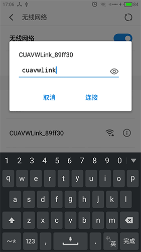
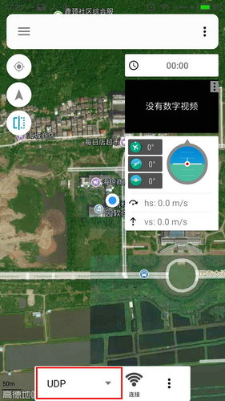

# 软件使用说明

### HFlight 连接方式

---

**HFlight** 安卓手机地面站是 **雷讯（CUAV）** 官方推广的手机地面站，完美地兼容本公司所有产品，欢迎广大模友下载使用。软件下载链接：[HFlight](http://fw.cuav.net/apk/HFlight.apk)。

对于 PW-Link 无线数传模块，HFlight 获取和显示飞控信息的步骤如下：

 1. 确认 PW-Link 与 Pix 飞控已经连接正常；

 2. 手机搜索 WiFi 网络，连接名称为：CUAVWlink_XXXXXX 的网络，操作如下图；
 
  

 3. 打开 HFlight 手机软件，选择 UDP 连接方式，操作如图；
  
  

 4. 确认 UDP 服务器通信端口，检查端口是否为 14550；
 
  

 5. 最后点击 **连接** 按钮，成功获取飞控信息后，数据界面会显示出来；

### 修改网络 SSID 及密码

---

1、弹出菜单栏

2、点击系统按钮

3、长按无线图标，会弹出对话框

4、点击查询按钮

5、获取到信息

6、在对应的框修改内容，点确认即可修改生效

7、建议使用11以上的频道，避免遥控器被干扰。

> 注意：请不要在无人机的飞行过程中修改配置，以免出现通信异常。